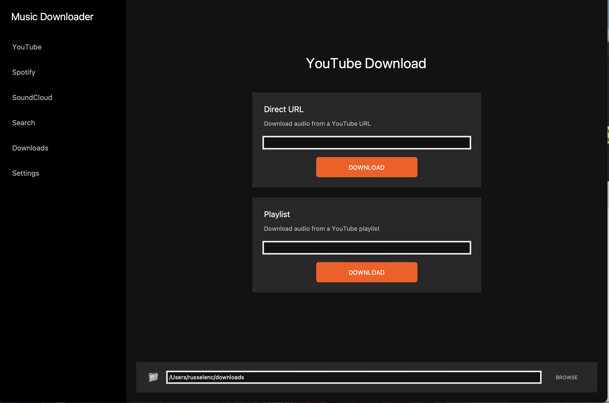

# 🎵 Music Downloader(Mac only)

**Music Downloader** est une application Python avec interface graphique qui permet de télécharger facilement de la musique depuis **YouTube**, **Spotify** et **SoundCloud**.

L'application utilise `yt-dlp` pour extraire l'audio, et propose une expérience simple et rapide pour créer sa propre bibliothèque musicale en local.

## ✅ Fonctionnalités actuelles

- 🔊 Téléchargement de musique depuis :
  - YouTube (recherche et lien direct)
  - Spotify (via lien direct)
  - SoundCloud (via lien direct)
- 🎧 Conversion automatique en format audio (.mp3)
- 🖥️ Interface graphique épurée avec `customtkinter`
- 📦 Version exécutable disponible pour Windows (.exe)

## 🚧 Fonctionnalités manquantes / à venir

- 🔍 Recherche intégrée pour Spotify et SoundCloud
- ⚙️ Plus de réglages (choix du format, qualité audio, dossier de téléchargement)
- 🚀 Optimisation générale (performances, gestion d’erreurs)
- 🌐 Détection automatique de métadonnées (titre, artiste, etc.)

## 🛠️ Installation (pour développeurs)

Clone le dépôt :
   ```bash
   git clone git@github.com:lulruru/Music-Downloader.git
   cd Music-Downloader
   open MusicDownloader
ou
  Telecharger le zip
  Extraire le zip
  Ouvrir Music-Downloader

## 📸 Aperçu

